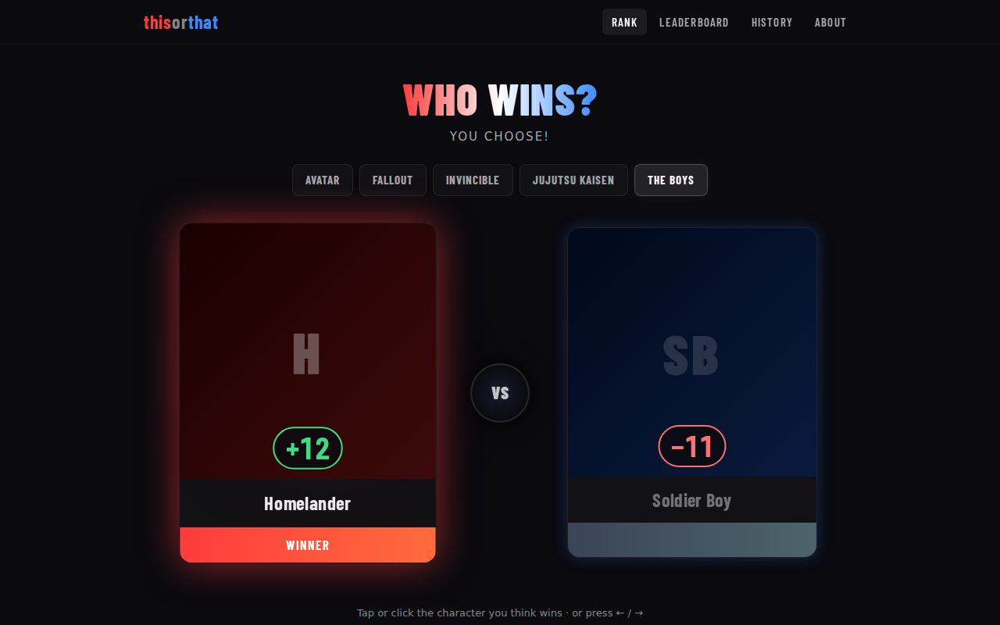
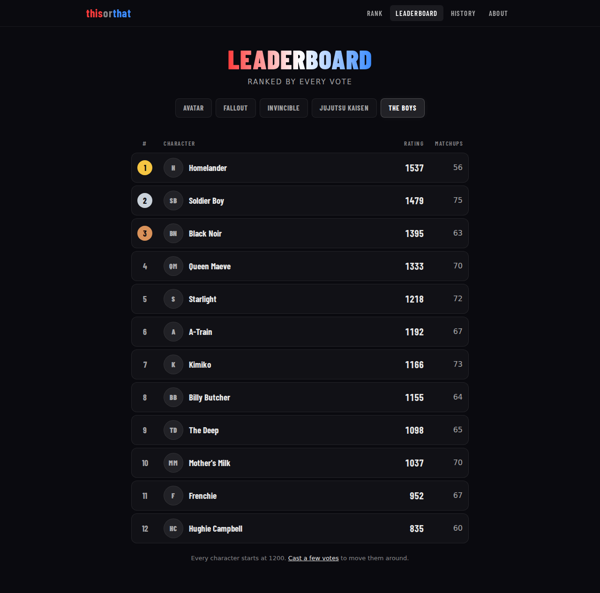
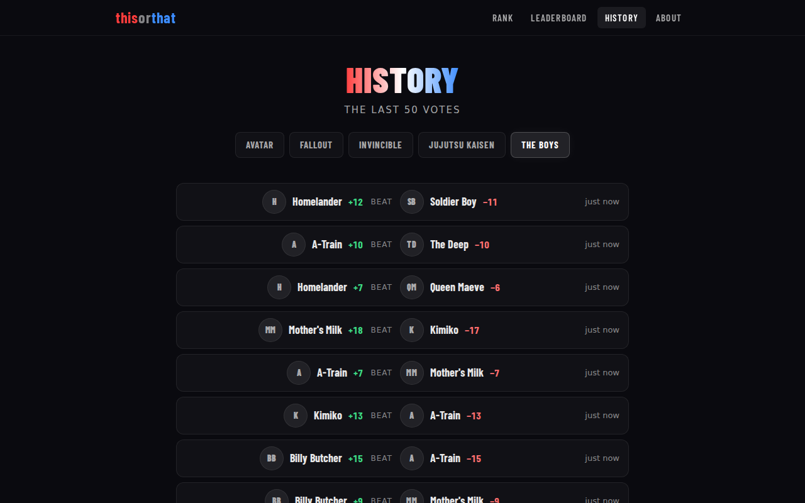
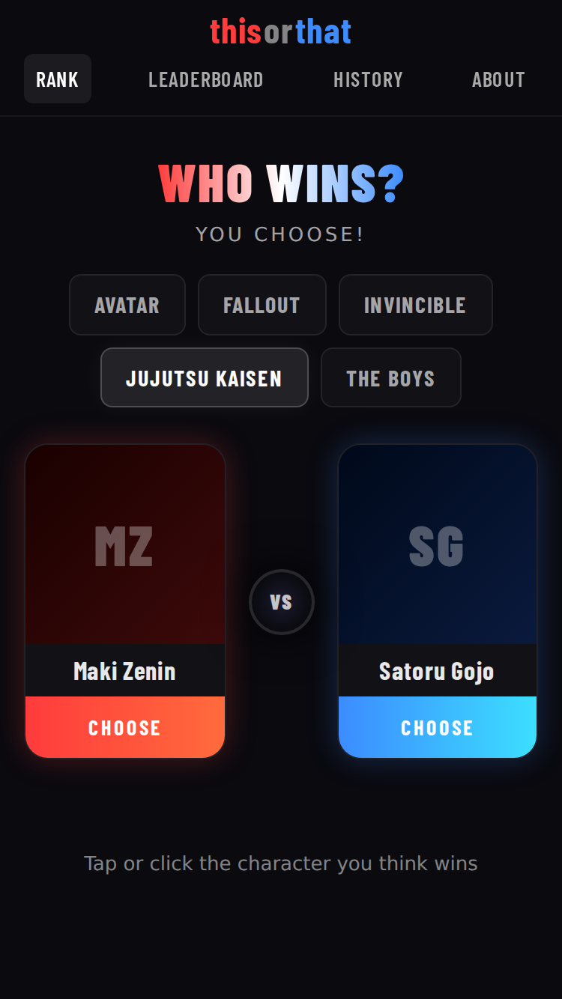
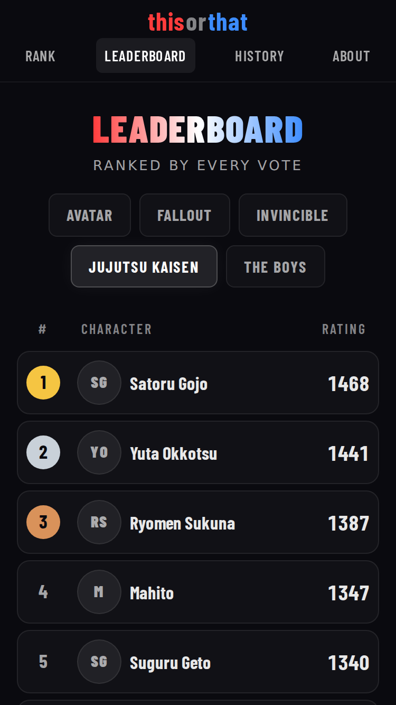

# thisorthat

Rank characters from your favorite franchises, one head-to-head vote at a time. Pick who wins between two characters, and every vote updates both of their [Elo ratings](https://en.wikipedia.org/wiki/Elo_rating_system).



<table>
  <tr>
    <td></td>
    <td></td>
  </tr>
</table>

<p>
  
  &nbsp;
  
</p>

## Features

- **Head-to-head voting.** Click a character or press <kbd>←</kbd> / <kbd>→</kbd>. Both cards then show how far each rating moved before the next matchup loads.
- **Leaderboard** for each franchise. Ties share a rank, and ratings that are still settling are marked as new.
- **History** of recent votes, with the rating swing from each one.
- **Responsive**, from a 320px phone up to desktop, with keyboard support and screen reader labels.

## How the ranking works

Every character starts at 1200. The gap between two ratings predicts how likely each is to win, and after a vote both ratings move toward the result. Beating the favorite moves you a lot; beating someone you were expected to beat barely moves you. On top of standard Elo:

- **The K-factor depends on games played.** K sets how far a single vote moves a rating. Here K = 16 + 48 × 15 / (15 + games played), so it starts at 64, is 40 after 15 games, and levels off toward 16. New characters find their spot quickly, and established rankings don't swing on one vote. In simulation, this places new characters faster than the classic fixed K = 30 and keeps settled ratings about 25% steadier. `TestDynamicKBeatsFixedK` checks both.
- **Rating changes are rounded, not truncated.** Truncating lost about a point from the pool on almost every vote. Now, when both characters have played equally often, what one gains the other loses exactly. Ratings can't drop below 100.
- **Votes are atomic.** Reading both ratings, updating them and logging the match happen in one `BEGIN IMMEDIATE` transaction. Simultaneous votes queue up instead of overwriting each other. `TestRecordMatchConcurrentVotesAreNotLost` sends 50 votes at once and checks that all 50 count; with the transaction removed, only 6–8 of them do.
- **Matchmaking is weighted, not random.** The first character is picked with weight 1/√(1 + games played), so newer characters come up more often. Its opponent is weighted by p(1 − p), the variance of the result, which favors close matchups because they tell you the most. The client sends the pair it just showed so it isn't served again, and the two sides are shuffled so the favored pick doesn't always land on the left.
- **Votes are rate limited per IP**: a burst of 10, then 1 per second. X-Forwarded-For is only trusted from configured proxies, so a client can't claim a fresh IP on every request.

## Tech

| | |
|---|---|
| **API** | Go, [Gin](https://gin-gonic.com), SQLite through [go-sqlite3](https://github.com/mattn/go-sqlite3) |
| **Data layer** | A hand-written adapter over `database/sql`: explicit column lists and a generic scanner, a `WithTx` helper that nests, versioned migrations, foreign keys and WAL mode |
| **Client** | React 19, TypeScript, Vite, React Router, [nanostores](https://github.com/nanostores/nanostores), plain CSS per component |
| **Tests** | Go tests for the rating math, matchmaking, seeding, the data layer and the HTTP handlers. The last two run against in-memory SQLite, plus a file-backed database for the concurrency test. |

## Running it locally

You'll need **Go 1.23+** with a C compiler (go-sqlite3 uses cgo, so install `gcc`), **Node 20.19+** or 22.12+, and **pnpm**.

**1. Start the API** from the repo root (it listens on port 8080):

```bash
cd server
cp .env.example .env
go run .
```

**2. Add some data.** In another terminal, still in `server/`:

```bash
go run ./cmd/seed -votes 300
```

This adds 5 franchises and 51 characters, then simulates 300 votes in each franchise so the leaderboard and history have something to show. Leave off `-votes` to start with every character at 1200. It's safe to run more than once, because anything that already exists is left alone. To seed your own franchises, see [Seeding](#seeding).

**3. Start the client** in a third terminal, from the repo root:

```bash
cd client
pnpm install
pnpm dev
```

Then open http://localhost:5173.

In development the browser only talks to Vite, which forwards `/api/*` to the Go server. That avoids CORS, and under WSL it also avoids a clash with any Windows program that's already using port 8080.

## Seeding

`go run ./cmd/seed` reads the built-in list in [`server/internal/seed/franchises.json`](server/internal/seed/franchises.json), or your own file with `-file`:

```json
[
  {
    "name": "invincible",
    "characters": [
      { "name": "Omni Man", "picture_url": "https://example.com/omni-man.png" },
      { "name": "Atom Eve" }
    ]
  }
]
```

- Names match ignoring case and surrounding spaces. Only franchises and characters that don't exist yet are added, and existing ratings are never changed.
- Everything goes in one transaction, so a bad file adds nothing. Unknown fields such as a misspelled `pictureUrl` are rejected rather than ignored.
- A character without a `picture_url` is shown with their initials.
- With `-votes N`, simulated voters mostly agree with the order characters are listed in, strongest first, but upsets happen. The pairs come from the real matchmaking and every vote goes through the same code path as a real one.

The database comes from `DB_URL` in `server/.env`. To seed a different file, set it inline, for example `DB_URL=./demo.db go run ./cmd/seed`.

## Configuration

**`server/.env`** ([example](server/.env.example))

| Variable | | |
|---|---|---|
| `DB_URL` | required | Path to the SQLite file. It's created and migrated on first run. |
| `PLATFORM` | required | `dev` enables the write endpoints below. Anything else, such as `prod`, turns them off. |
| `PORT` | default `8080` | |
| `TRUSTED_PROXIES` | optional | Comma-separated IPs or CIDRs allowed to set X-Forwarded-For. Only needed behind a reverse proxy. |

**`client/.env`** ([example](client/.env.example)): nothing is required locally.

| Variable | | |
|---|---|---|
| `API_PROXY_TARGET` | default `http://localhost:8080` | Where Vite's `/api` proxy sends requests |
| `VITE_API_URL` | default `/api` | The API's full URL, for a production build that isn't served under `/api` |

## API

Errors come back as `{ "error": "..." }` with a matching status code: 400 for a bad request, 404 when a list or character doesn't exist.

| Method | Path | |
|---|---|---|
| `GET` | `/healthz` | Health check |
| `GET` | `/lists` | Every franchise, sorted by name |
| `GET` | `/lists/:id` | One franchise |
| `GET` | `/lists/:id/characters` | Its characters, sorted by name |
| `GET` | `/lists/:id/leaderboard` | Its characters ranked by rating, with ties sharing a rank |
| `GET` | `/lists/:id/matchup?exclude=<id>,<id>` | The next two characters to vote on. `exclude` is a recently shown pair and can be repeated up to 20 times. Returns 409 if the franchise has fewer than two characters. |
| `GET` | `/lists/:id/matches?limit=20` | Recent votes, newest first. The limit is capped at 100. |
| `GET` | `/characters/:id` | One character |
| `POST` | `/matches` | Record a vote with `{ "winner_id": "…", "loser_id": "…" }`. Returns 201 with the rating changes, or 429 with `Retry-After` when rate limited. |

Only when `PLATFORM=dev`: `POST /lists` `{ "name" }`, `POST /characters` `{ "name", "picture_url", "list_id" }`, and `POST /reset`, which deletes everything.

## Tests

```bash
cd server && go test -race ./...
cd client && pnpm lint && pnpm build
```

## Project layout

```
server/
  main.go, router.go         config and routes
  handler_*.go               HTTP handlers
  ratelimit.go               per-IP token buckets for votes
  cmd/seed/                  the seed command
  internal/database/         SQL adapter, migrations, queries
  internal/elo/              rating math and matchmaking
  internal/seed/             seed file parsing, seeding, vote simulation
client/src/
  data/api.ts                typed API calls
  hooks/                     useQuery, useMatchup, and the per-endpoint query hooks
  components/                shared components: avatar, rating change, status states, franchise picker
  pages/                     rank, leaderboard, history, about
docs/screenshots/            the images above
```
